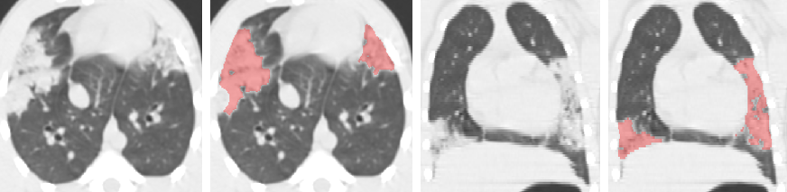
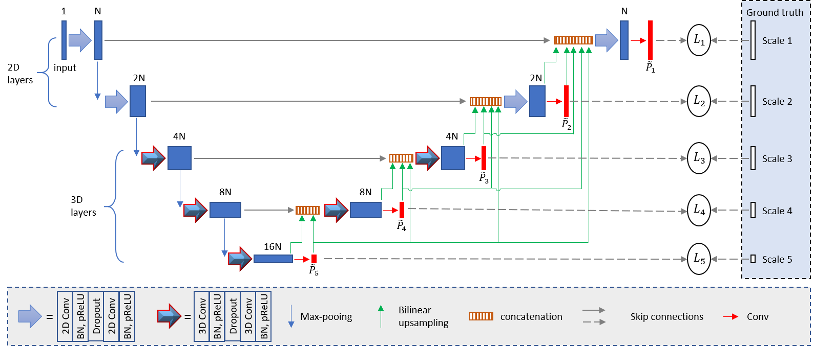

# PF-Net: Pulmonary Fibrosis Segmentation Network with Multi-Scale Guided Dense Attention
This repository provides source code of PF-Net for pulmonary firbrosis segmentation proposed by G. Wang et al.[1]. If you use this code, please cite the following paper:

* [1] G. Wang et al. Semi-Supervised Segmentation of Radiation-Induced Pulmonary Fibrosis from Lung CT Scans with Multi-Scale Guided Dense Attention, submitted to IEEE Transactions on Medical Imaging, 2021.

The structure of PF-Net. It combines 2D and 3D convolutions to deal with images with anisotropic resolution. For example, the in-plane resolution is around 4 times of through-plane resolution, and we use 2D convolutions for the first two levels and 3D convolutions for the other levels in the encoder. Multi-Scale Guided Dense Attention is introduced in the decoder to deal with lesions with various positions, sizes and shapes. 

# Requirements
* [Pytorch][torch_link] version >=1.0.1.
* [PyMIC][pymic_link], a Pytorch-based toolkit for medical image computing. Version 0.2.3 is required. Install it by `pip install PYMIC==0.2.3`.
* Some basic python packages such as Numpy, Pandas, SimpleITK.

[torch_link]:https://pytorch.org
[pymic_link]:https://github.com/HiLab-git/PyMIC

